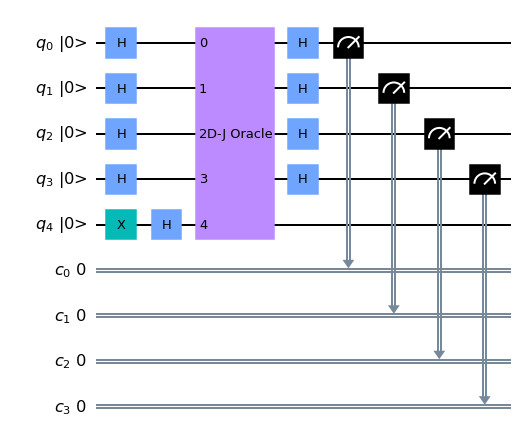
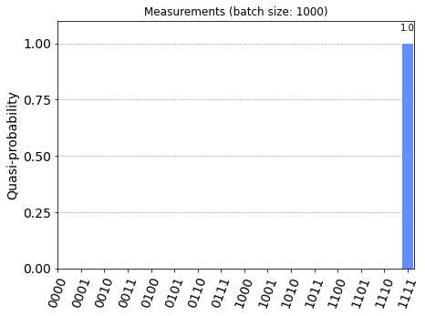
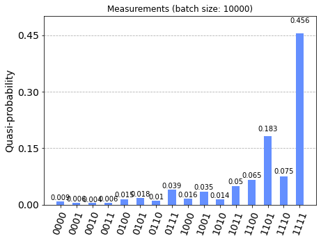

# [Deutsch-Jozsa Algorithm](../notebooks/deutsch_jozsa.ipynb) #

The methods for developing the circuits can be found in [src/algorithms/deutsch_jozsa.py](../src/algorithms/deutsch_jozsa.py).

## Demonstration ##

See [examples/deutsch_jozsa.md](../examples/deutsch_jozsa.md)


```python
'''IMPORTS'''
...
```


```python
'''Example with simulator'''
...

action_display_statistics(queue=False, as_widget=False);
```


<h3>Quantumcircuit for testing Deutsch-Josza algorithm</h3>





<b>NOTE:</b>
<ul>
    <li>backend: <b>aer_simulator</b></li>
    <li>job id: <b>*****</b></li>
</ul>


<p style="color:blue;"><b>[INFO]</b> Wait for job to finish...</b>





```python
'''Example with IBM cloud backend (queue)'''
...
```


<h3>Quantumcircuit for testing Deutsch-Josza algorithm</h3>


<b>NOTE:</b>
<ul>
    <li>backend: <b>ibmq_belem</b></li>
    <li>job id: <b>*****</b></li>
</ul>


```python
'''Statistics for backend job - NOTE: job may be pending'''
...
```



