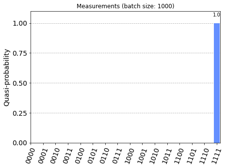

# [Deutsch-Jozsa Algorithm](../notebooks/deutsch_jozsa.ipynb) #

The methods for developing the circuits can be found in [src/algorithms/deutsch_jozsa.py](../src/algorithms/deutsch_jozsa.py).

## Demonstration ##

See [examples/deutsch_jozsa.md](../examples/deutsch_jozsa.md)


```python
'''IMPORTS'''
...
```


```python
'''Example with simulator'''
...
```

    Quantumcircuit for testing Deutsch-Josza algorithm


    NOTE:
    - backend: aer_simulator
    - job id: *****





```python
'''Example with IBM cloud backend (queue)'''
...
```


```python
'''Statistics for backend job - NOTE: job may be pending'''
...
```


