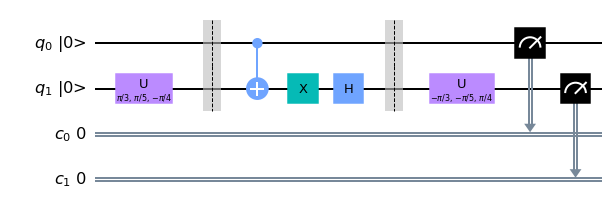
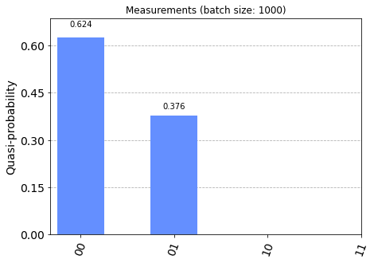
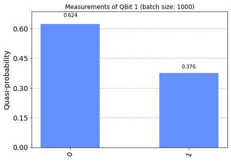

# [Examples](../notebooks/examples.ipynb) #

This notebook demonstrates usage of IBM qiskit, how to deal in this repository with circuits to be executed on the simulator, and those to be properly run on the backend ('queue').

## Demonstration ##

See [examples/examples.md](../examples/examples.md).


```python
'''IMPORTS'''
...
```


```python
'''Example circuit'''
...
```


<h3>Example quantum circuit</h3>





```python
'''Example usage of simulator'''
...
```


<h3>Example quantum circuit with simulator</h3>


<b>NOTE:</b>
<ul>
    <li>backend: <b>aer_simulator</b></li>
    <li>job id: <b>*****</b></li>
</ul>


<p style="color:blue;"><b>[INFO]</b> Wait for job to finish...</b>








```python
'''Display list of IBM backend options'''
...
```


<b>AVAILABLE BACKENDS (SIMULATOR):</b>
<ul>
<li>ibmq_qasm_simulator</li>
<li>simulator_statevector</li>
<li>simulator_mps</li>
<li>simulator_extended_stabilizer</li>
<li>simulator_stabilizer</li>
</ul>
</br>
<b>AVAILABLE BACKENDS (QUEUE):</b>
<ul>
<li>ibmq_lima</li>
<li>ibmq_belem</li>
<li>ibmq_quito</li>
<li>ibmq_manila</li>
<li>ibm_nairobi</li>
<li>ibm_oslo</li>
</ul>


```python
'''Example usage of IBM cloud backend (queue)'''
...
```


<h3>Example quantum circuit with backend</h3>


<b>NOTE:</b>
<ul>
    <li>backend: <b>ibmq_belem</b></li>
    <li>job id: <b>*****</b></li>
</ul>


```python
'''Statistics for backend job - NOTE: job may be pending'''
...
```


