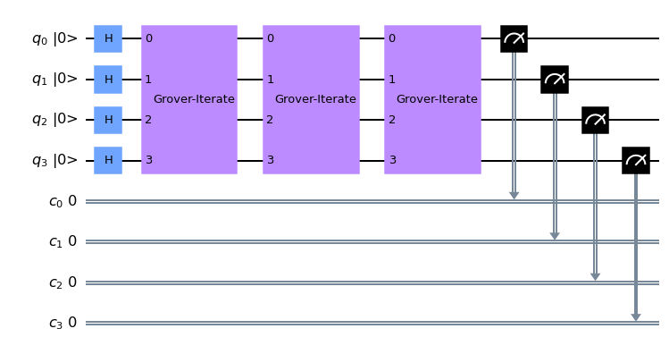
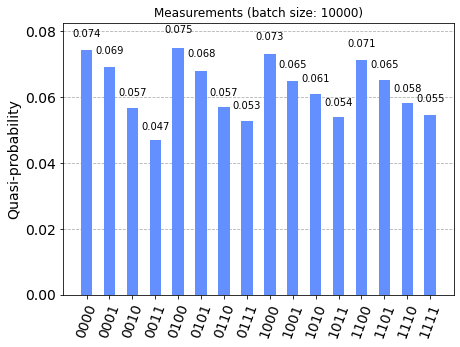

# Grover's Algorithm #

The methods for developing the circuits can be found in [src/algorithms/grover.py](../src/algorithms/grover.py).


```python
'''IMPORTS'''
...
```


```python
'''Example with simulator'''
...
```

    Quantumcircuit for testing Grover algorithm
    4 qubits, basis state ['1011'] marked, r=3 rounds





    NOTE:
    - backend: qasm_simulator
    - job id: *****


```python
'''Example with IBM cloud backend (queue)'''
...
```


```python
'''Statistics for backend job - NOTE: job may be pending'''
...
```



