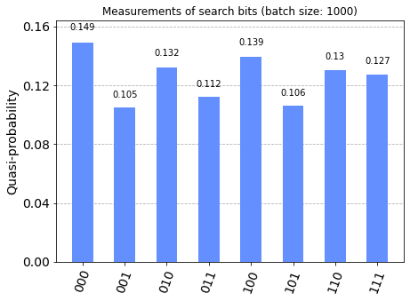

# [Grover's Algorithm](../notebooks/grover.ipynb) #

The methods for developing the circuits can be found in [src/algorithms/grover.py](../src/algorithms/grover.py). This notebook demonstrates Grover's search algorithm. This consists is used to solve the following

> **Problem:** Given a function $f:\{0,1\}^{n} \to \{0,1\}$ find any (or all) $x\in\{0,1\}^{n}$ for which $f(x)=1$.

and an approach via quantum computing consists of the following:

1. Construct a **phase oracle** $P_{f}$ for the oracle $U_{f}$.
2. Construct the Grover Iterator, $G = P_{0^{\perp}}P_{f}$, which assists with amplitude amplification.
3. Determine the optimal number of iterations $r\in\mathbb{N}$, which depends on the number of possible solutions to the problem via $r \approx \frac{\pi}{4\arcsin(\sqrt{m/2^{n}})} - \frac{1}{2}$.
4. Prepare a quantum circuit applying the $n$-fold Hadamard operator to the input gates followed by $r$ iterations of $G$.

Provided the (phase) oracle works, the theory (cf. §8.1 and in particular Thm 8.1.1 in [^1]) yields that the final state of the circuit is a vector which has an optimal amplification of the basis vectors corresponding to solutions to the problem. Measuring the final state thus yields a solution with high probability.

## Constructing the phase oracle ##

We can consider the _Boolean satisfiability problem_ (or SAT).
An instance of this problem is a formula $F$ in propositional logic in _conjunctive normal form_ (CNF) and depending on $n$ atoms $x_{1},x_{2},\ldots,x_{n}$. The goal is to determine truth values (or values in $\{0,1\}$) which make $F$ true, i.e. $f$ is here simply the evaluation of $F$ under different assignments for the atoms.

The DIMACS standard (cf. <https://people.sc.fsu.edu/~jburkardt/data/cnf/cnf.html>) can be used to encode descriptions of such problems.
Relying on the [grammar](../assets/DIMACS.lark), in the source code a [parser](../src/parsers/dimacs.py) is used to [extract problem descriptions](../src/models/boolsat/dimacs.py) from files.

The above website provides some examples files, which we store in a **data** folder. Users can download these or create their own SAT problems, and use correspondingly adjust the paths in the cells in this notebook.

## Demonstration ##

See [examples/grover.md](../examples/grover.md).

----
[^1]: P. Kaye, R. Laflamme, and M. Mosca. _An introduction to quantum computing._ Oxford University Press, Oxford, **2007**.


```python
'''IMPORTS'''
...
```


```python
problem = basic_action_prepare_problem(path='data/*****.txt', verbose=True);
basic_action_display_circuit(problem=problem, q_min=0.1, prob_min=0.01);
```


Load SAT Problem from <b><code>data/*****.txt</code></b>:


$\begin{array}{cl}
&(x_{0}\,\vee\,\neg x_{2})\\
\wedge &(\neg x_{0}\,\vee\,x_{1}\,\vee\,x_{2})\\
\end{array}$


<h3>Quantumcircuit for Grover Iterator</h3>


```python
'''Example with simulator'''
...
```


<h3>Quantumcircuit for testing Grover algorithm</h3>


<b>NOTE:</b>
<ul>
    <li>backend: <b>qasm_simulator</b></li>
    <li>job id: <b>*****</b></li>
</ul>


<p style="color:blue;"><b>[INFO]</b> Wait for job to finish...</b>


```python
'''Example with IBM cloud backend (queue)'''
...
```


<h3>Quantumcircuit for testing Grover algorithm</h3>


<b>NOTE:</b>
<ul>
    <li>backend: <b>ibm_oslo</b></li>
    <li>job id: <b>*****</b></li>
</ul>


```python
'''Statistics for backend job - NOTE: job may be pending'''
...
```



