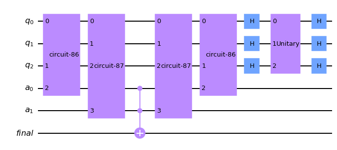

# [Grover's Algorithm](../notebooks/grover.ipynb) #

The methods for developing the circuits can be found in [src/algorithms/grover.py](../src/algorithms/grover.py).

## Demonstration ##

See [examples/grover.md](../examples/grover.md).


```python
...
```


```python
'''Example with simulator'''
...
```

    Quantumcircuit for testing Grover algorithm
    4 qubits, basis state ['1011', '0100'] marked, r=2 rounds


    NOTE:
    - backend: qasm_simulator
    - job id: *****





```python
'''Example with IBM cloud backend (queue)'''
...
```

    Quantumcircuit for testing Grover algorithm
    4 qubits, basis state ['1001', '0000'] marked, r=2 rounds


```python
'''Statistics for backend job - NOTE: job may be pending'''
...
```


