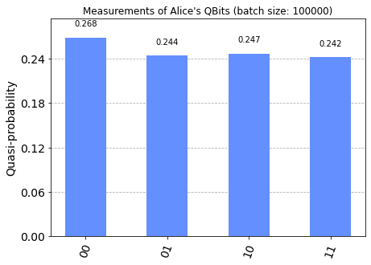

# [Teleportation](../notebooks/teleportation.ipynb) #

The methods for developing the circuits can be found in [src/algorithms/teleport.py](../src/algorithms/teleport.py).

## Description of test ##

- After creation of the entangled pair,
  a random state `|ψ⟩ = U|0⟩` is generated at start
  via a 'randomly generated' unitary `U`.
- To test that `|ψ⟩` is successfully teleported,
  after the teleportation protocol, we apply the inverse of `U`
  to Bob's state and measures it against `{|0⟩, |1⟩}`.
  The teleportation is thus successful exactly in case this bit is consistently `|0⟩`.
- We also expect that Alices bits be uniformly randomly distributed
  at the end of the teleportation protocol.

In the simulator, these expectations are indeed met.
In the backend, these expectations are only approximately attained.

## Demonstration ##

See [examples/teleportation.md](../examples/teleportation.md).


```python
'''IMPORTS'''
...
```


```python
basic_action_display_circuit();
```


<h3>Quantumcircuit for Teleportation</h3>


```python
'''Example with simulator'''
...
```


<h3>Quantumcircuit for testing teleportation protocol</h3>


<b>NOTE:</b>
<ul>
    <li>backend: <b>aer_simulator</b></li>
    <li>job id: <b>*****</b></li>
</ul>


<p style="color:blue;"><b>[INFO]</b> Wait for job to finish...</b>


```python
'''Example with IBM cloud backend (queue)'''
...
```


<h3>Quantumcircuit for testing teleportation protocol</h3>


<b>NOTE:</b>
<ul>
    <li>backend: <b>ibm_oslo</b></li>
    <li>job id: <b>*****</b></li>
</ul>


```python
'''Statistics for backend job - NOTE: job may be pending'''
...
```





