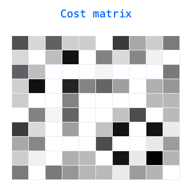
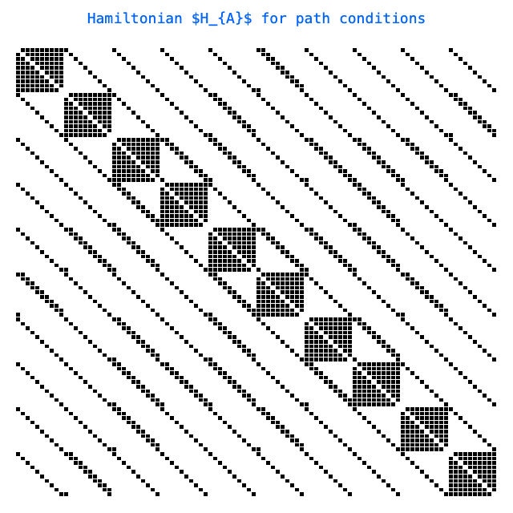
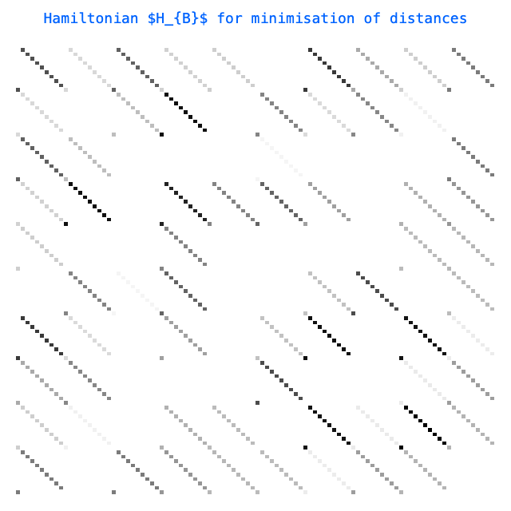
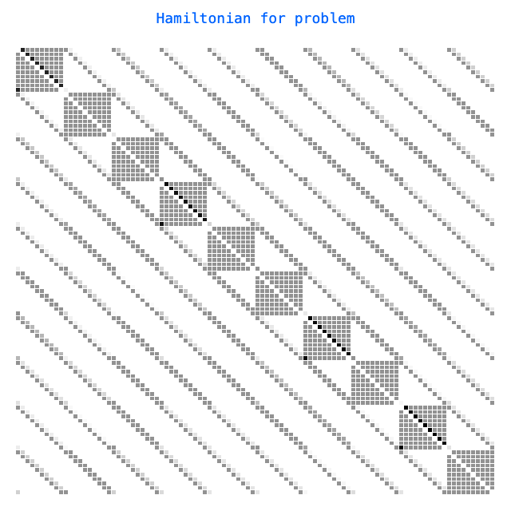

# [QuBO for the TSP](../notebooks/tsp.ipynb) #

This notebook prepares a Hamiltonian for a randomly generated TSP problem.


```python
"""IMPORTS"""
import os
import sys

# NOTE: need this to force jupyter to reload imports:
for key in list(sys.modules.keys()):
    if key.startswith("src."):
        del sys.modules[key]

os.chdir(os.path.dirname(_dh[0]))  # noqa
sys.path.insert(0, os.getcwd())

from itertools import product

import numpy as np
import plotly.graph_objects as pgo
import polars as pl
from IPython.display import display

from src.setup import *
from src.thirdparty.plots import *

set_rng_seed();  # for repeatability
```


```python
# create random labeled
n = 10
prob_edge = 0.8
cost_max = 100

Nodes = range(n)
K_Nodes = set(product(Nodes, Nodes))
D_Nodes = set(zip(Nodes, Nodes))
E_Nodes = set()
u = np.random.rand(n, n) < prob_edge / 2
u = u | u.T
cost = 1 + (cost_max - 1) * (np.random.rand(n, n))
cost = (cost + cost.T) / 2 * u
E_Nodes = set(zip(*[_.tolist() for _ in np.where(u)]))

# create "time"-graph
T_max = n
Time = range(T_max)
K_Time = set(product(Time, Time))
D_Time = set(zip(Time, Time))
E_Time = set((t, (t + 1) % T_max) for t in Time)
```


```python
# Hamiltonian to encode computation of all paths
H_A = np.zeros(shape=[n, n, n, n], dtype=int)

# penalise adjacent steps (x[t], x[t+1]) for being non-edges
for (u, v), (t1, t2) in product(K_Nodes - E_Nodes, E_Time):
    H_A[u, t1, v, t2] = 1

# penalise steps x[t] adopting multiple values
for (u, v), t in product(K_Nodes - D_Nodes, Time):
    H_A[u, t, v, t] = 1  # why?

# penalise multiple occurrences in x[0], x[1], ..., x[n-1]
for u, (s, t) in product(Nodes, K_Time - D_Time):
    H_A[u, s, u, t] = 1
```


```python
# Hamiltonian for minimisation of distances
H_B = np.zeros(shape=[n, n, n, n], dtype=int)

# penalise steps according to the cost
for (u, v), (t1, t2) in product(E_Nodes, E_Time):
    H_B[u, t1, v, t2] = cost[u, v]
```


```python
H_A = H_A.reshape((n * n, n * n))
H_B = H_B.reshape((n * n, n * n))
H = H_A + H_B / cost_max
# NOTE: eigenvalues are sorted in ascending order
eig, _ = np.linalg.eigh(H)
data_frame = pl.from_dict({"Eigenvalue": eig}, schema={"Eigenvalue": pl.Float64})
display(data_frame)
```

<div><style>
.dataframe > thead > tr,
.dataframe > tbody > tr {
  text-align: right;
  white-space: pre-wrap;
}
</style>
<small>shape: (100, 1)</small><table border="1" class="dataframe"><thead><tr><th>Eigenvalue</th></tr><tr><td>f64</td></tr></thead><tbody><tr><td>-4.753847</td></tr><tr><td>-4.742218</td></tr><tr><td>-4.55818</td></tr><tr><td>-4.532143</td></tr><tr><td>-4.282772</td></tr><tr><td>&hellip;</td></tr><tr><td>10.571533</td></tr><tr><td>10.685739</td></tr><tr><td>12.735749</td></tr><tr><td>12.871123</td></tr><tr><td>23.580102</td></tr></tbody></table></div>

```python
fig = pgo.Figure(
    data=[
        pgo.Heatmap(
            z=cost,
            x=list(range(n)),
            y=list(range(n)),
            xgap=1,
            ygap=1,
            colorbar_thickness=20,
            colorbar_ticklen=3,
            showscale=False,
            colorscale=PLOTLY_COLOUR_SCHEME.GREYS.value,
        )
    ],
    layout=pgo.Layout(
        title=dict(
            text="Cost matrix",
            x=0.5,
            y=0.95,
            font=dict(
                family="monospace",
                size=18,
                color="rgba(0,100,255,1)",
            ),
        ),
        width=320,
        height=320,
        yaxis_autorange="reversed",
        showlegend=False,
        xaxis_showgrid=False,
        yaxis_showgrid=False,
        xaxis=dict(visible=False),
        yaxis=dict(visible=False),
        margin=dict(l=20, r=20, t=60, b=20),
    ),
)
display(fig)
```



```python
fig = pgo.Figure(
    data=[
        pgo.Heatmap(
            z=H_A,
            x=list(range(n * n)),
            y=list(range(n * n)),
            xgap=1,
            ygap=1,
            colorbar_thickness=20,
            colorbar_ticklen=3,
            showscale=False,
            colorscale=PLOTLY_COLOUR_SCHEME.GREYS.value,
        )
    ],
    layout=pgo.Layout(
        title=dict(
            text=r"Hamiltonian $H_{A}$ for path conditions",
            x=0.5,
            y=0.975,
            font=dict(
                family="monospace",
                size=18,
                color="rgba(0,100,255,1)",
            ),
        ),
        width=640,
        height=640,
        yaxis_autorange="reversed",
        showlegend=False,
        xaxis_showgrid=False,
        yaxis_showgrid=False,
        xaxis=dict(visible=False),
        yaxis=dict(visible=False),
        margin=dict(l=20, r=20, t=60, b=20),
    ),
)
display(fig)
```



```python
fig = pgo.Figure(
    data=[
        pgo.Heatmap(
            z=H_B,
            x=list(range(n * n)),
            y=list(range(n * n)),
            xgap=1,
            ygap=1,
            colorbar_thickness=20,
            colorbar_ticklen=3,
            showscale=False,
            colorscale=PLOTLY_COLOUR_SCHEME.GREYS.value,
        )
    ],
    layout=pgo.Layout(
        title=dict(
            text=r"Hamiltonian $H_{B}$ for minimisation of distances",
            x=0.5,
            y=0.975,
            font=dict(
                family="monospace",
                size=18,
                color="rgba(0,100,255,1)",
            ),
        ),
        width=640,
        height=640,
        yaxis_autorange="reversed",
        showlegend=False,
        xaxis_showgrid=False,
        yaxis_showgrid=False,
        xaxis=dict(visible=False),
        yaxis=dict(visible=False),
        margin=dict(l=20, r=20, t=60, b=20),
    ),
)
display(fig)
```



```python
fig = pgo.Figure(
    data=[
        pgo.Heatmap(
            z=H,
            x=list(range(n * n)),
            y=list(range(n * n)),
            xgap=1,
            ygap=1,
            colorbar_thickness=20,
            colorbar_ticklen=3,
            showscale=False,
            colorscale=PLOTLY_COLOUR_SCHEME.GREYS.value,
        )
    ],
    layout=pgo.Layout(
        title=dict(
            text="Hamiltonian for problem",
            x=0.5,
            y=0.975,
            font=dict(
                family="monospace",
                size=18,
                color="rgba(0,100,255,1)",
            ),
        ),
        width=640,
        height=640,
        yaxis_autorange="reversed",
        showlegend=False,
        xaxis_showgrid=False,
        yaxis_showgrid=False,
        xaxis=dict(visible=False),
        yaxis=dict(visible=False),
        margin=dict(l=20, r=20, t=60, b=20),
    ),
)
display(fig)
```


